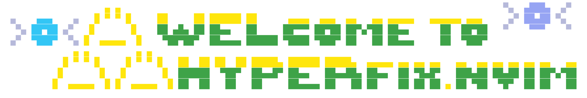
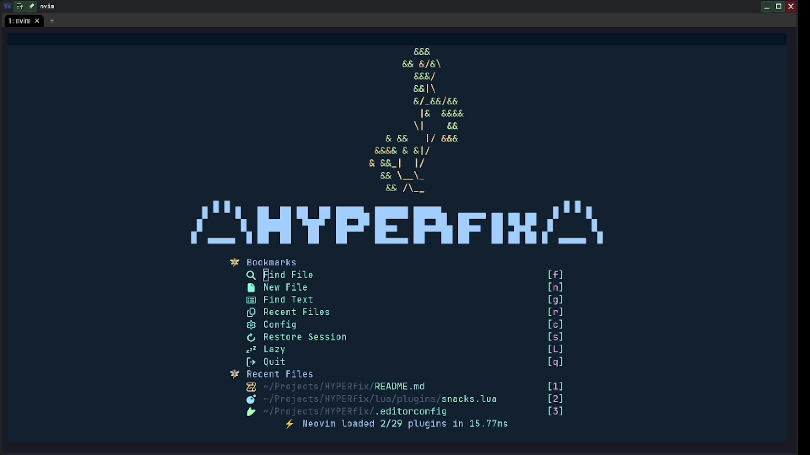
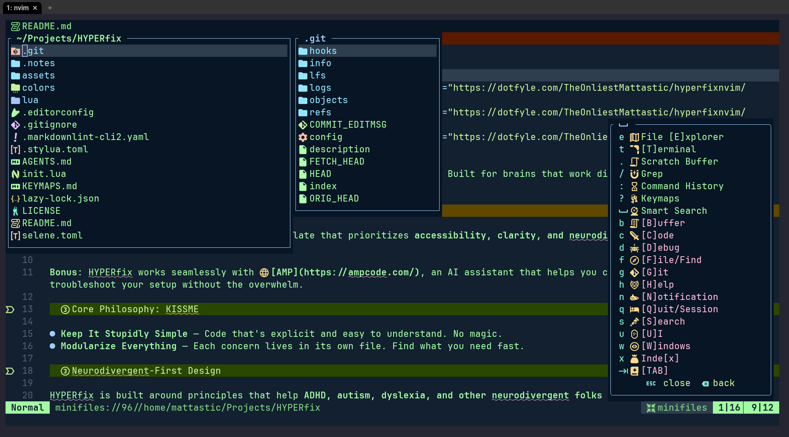

# ⚔️ HYPERfix.nvim







<a href="https://dotfyle.com/TheOnliestMattastic/hyperfixnvim"></a>
<a href="https://dotfyle.com/TheOnliestMattastic/hyperfixnvim"></a>
<a href="https://dotfyle.com/TheOnliestMattastic/hyperfixnvim"></a>
<a href="https://neovim.io/"></a>
<a href="https://github.com/theonliestmattastic/hyperfix.nvim/actions"></a>
<a href="https://github.com/theonliestmattastic/hyperfix.nvim"></a>
<a href="https://www.w3.org/WAI/WCAG21/quickref/"></a>

> **A universally designed Neovim template for neurodivergent developers.** Built for brains that work differently—and think that's awesome.

## What Is This?

**HYPERfix.nvim** is a Neovim configuration template that prioritizes **accessibility, clarity, and neurodivergent-friendly design** from the ground up.

**Built for learning.** HYPERfix is designed to help new Neovim users (and anyone new to coding) learn by configuring and personalizing their setup. Extensive comments explain WHAT/WHY/HOW for every decision so you understand the system.

**AI-powered by design.** HYPERfix integrates **[AMP](https://ampcode.com/)**, an AI assistant that understands your codebase. Use it to reduce cognitive load, learn faster, and skip tedious, repetitive tasks. AI isn't a distraction—it's a feature, especially for neurodivergent brains that benefit from cognitive support.

### Core Philosophy: KISSME

- **Keep It Stupidly Simple** — Code that's explicit and easy to understand. No magic.
- **Modularize Everything** — Each concern lives in its own file. Find what you need fast.

### Neurodivergent-First Design

HYPERfix is built around principles that help **ADHD, autism, dyslexia, and other neurodivergent folks** (and honestly, everyone):

- **Clear visual hierarchy** — 4px line spacing + WCAG AAA contrast ratios
- **Thoughtful pacing** — Longer timeouts (1250) for key sequences—time to think
- **Mnemonic keymaps** — `<leader>f` = find, `<leader>g` = git. Patterns you can predict
- **Explicit documentation** — Every code block explains WHAT/WHY/HOW
- **Graceful degradation** — Missing optional tools won't break your editor

## The Kokiri Forest: A Personalized Zelda Theme

> _It's dangerous to go alone! Take this._
>
> 🔥 🧙‍♂️🗡️ 🔥

HYPERfix embraces the **Legend of Zelda** universe as its thematic foundation. The Kokiri colorscheme, icons, and naming conventions create a **cohesive, immersive experience** that makes learning to code feel less like a chore and more like an adventure.

Why Zelda?

- **Timeless and universally beloved** — A familiar, welcoming reference point
- **Adventure and exploration** — Mirrors the learning journey of mastering your editor
- **Problem-solving and growth** — You start as a novice and level up through configuration
- **Accessibility for everyone** — Zelda games accommodate different play styles and abilities
- **Personalization matters** — Just like Link's journey is unique, so is your Neovim setup

Everything is customizable. Change the colorscheme, swap out icons, rebrand the theme—HYPERfix adapts to your vision.

## Inspired By Giants

Built on [Kickstart.nvim](https://github.com/nvim-lua/kickstart.nvim), [LazyVim](https://github.com/LazyVim/LazyVim), and [Mini.nvim](https://github.com/echasnovski/mini.nvim) — but with **neurodivergent-first accessibility** baked in.

## What's Inside?

- [echasnovski/mini.nvim](https://dotfyle.com/plugins/echasnovski/mini.nvim) — The "brain" of HYPERfix. Modules for alignment, surround, AI text objects, files, and more
- [folke/snacks.nvim](https://dotfyle.com/plugins/folke/snacks.nvim) — Dashboard, picker, and developer utilities
- [folke/flash.nvim](https://dotfyle.com/plugins/folke/flash.nvim) — Lightning-fast motion with `f`/`t` and Treesitter integration
- [folke/which-key.nvim](https://dotfyle.com/plugins/folke/which-key.nvim) — Discoverable keymaps with helpful descriptions
- [folke/trouble.nvim](https://dotfyle.com/plugins/folke/trouble.nvim) — Beautiful diagnostic and search results viewer
- [MagicDuck/grug-far.nvim](https://dotfyle.com/plugins/MagicDuck/grug-far.nvim) — Find and replace with previews
- [MeanderingProgrammer/render-markdown.nvim](https://dotfyle.com/plugins/MeanderingProgrammer/render-markdown.nvim) — Markdown rendered beautifully
- [nvim-treesitter/nvim-treesitter](https://dotfyle.com/plugins/nvim-treesitter/nvim-treesitter) — Syntax highlighting and text objects
- [saghen/blink.cmp](https://dotfyle.com/plugins/saghen/blink.cmp) — Lightning-fast completion engine
- [neovim/nvim-lspconfig](https://dotfyle.com/plugins/neovim/nvim-lspconfig) — Language server setup
- [mfussenegger/nvim-dap](https://dotfyle.com/plugins/mfussenegger/nvim-dap) — Debugging support
- [stevearc/conform.nvim](https://dotfyle.com/plugins/stevearc/conform.nvim) — Code formatting

## Install Guide

### Dependencies

You'll need a few things on your system. This should take ~5 minutes to install:

> Requires **Neovim 0.11+**. Always review the code before installing a configuration.

**Core Requirements:**

- Neovim 0.11+
- Git
- Ripgrep (for search)
- fd (for file finding)
- **AMP CLI** (for AI-assisted configuration) — optional, but recommended
- Nerd Font: Download Atkinson Mono from https://www.nerdfonts.com — optional

```bash
# macOS (Homebrew)
brew install neovim git ripgrep fd
brew install atkinson-mono-font  # Optional, for optimal readability
npm install -g @ampcode/cli      # AMP CLI for AI-assisted config

# Ubuntu/Debian
sudo apt install neovim git ripgrep fd-find
npm install -g @ampcode/cli      # AMP CLI

# Fedora/RHEL
sudo dnf install neovim git ripgrep fd
npm install -g @ampcode/cli      # AMP CLI
# Font: Download Atkinson Mono from https://www.nerdfonts.com (optional)

# Arch
sudo pacman -S neovim git ripgrep fd
npm install -g @ampcode/cli      # AMP CLI
# Font: yay -S atkinson-mono-font (optional)

# Windows (with Chocolatey)
choco install neovim git ripgrep fd nodejs
npm install -g @ampcode/cli      # AMP CLI
# Font: Download Atkinson Mono from https://www.nerdfonts.com (optional)
```

**Note on AMP:** The included `amp.nvim` plugin integrates AMP directly into your editor. If you prefer not to use AI assistance, the plugin can be safely deleted from `lua/plugins/`—HYPERfix will work perfectly without it.

### Quick Install

Replace your Neovim config with HYPERfix in one command:

**Linux/macOS:**

```bash
# Back up your current config (optional but smart)
mv ~/.config/nvim ~/.config/nvim.backup

# Clone HYPERfix
git clone https://github.com/TheOnliestMattastic/HYPERfix.nvim ~/.config/nvim

# Launch Neovim and let lazy.nvim install everything
nvim
```

**Windows (PowerShell):**

```powershell
# Back up your current config
Move-Item $env:APPDATA\nvim $env:APPDATA\nvim.backup -ErrorAction SilentlyContinue

# Clone HYPERfix
git clone https://github.com/TheOnliestMattastic/HYPERfix.nvim $env:APPDATA\nvim

# Launch Neovim
nvim
```

### What Happens Next

1. **lazy.nvim** bootstraps itself automatically
2. Plugins install on first launch
3. **Mason** installs LSPs and formatters for your languages
4. You're ready to edit

### Optional Tools (For Extra Flavor)

If you want the dashboard to look extra fancy, install one or more of these:

```bash
# Bonsai tree animation
sudo pacman -S cbonsai  # Arch
brew install cbonsai   # macOS
apt install cbonsai    # Debian/Ubuntu

# Fortune + cowsay + lolcat
brew install fortune cowsay lolcat  # macOS
apt install fortune cowsay lolcat   # Debian/Ubuntu
```

## Quick Start

Once installed:

1. **Open Neovim**: `nvim`
2. **Explore keymaps**: Press `<leader>?` (spacebar + question mark)
3. **Open the file explorer**: `<leader>e`
4. **Search for files**: `<leader><space>` (try `<leader>f` for more find options)
5. **Explore the help documents or config files**: `<leader>h`

All keymaps are **mnemonic** — if you remember the letter, you remember the command.

## Customization

HYPERfix is meant to be cloned/forked and modified. Here's where to make changes:

- **Keymaps**: `lua/config/keymaps.lua`
- **Editor settings**: `lua/config/options.lua`
- **Plugins**: `lua/plugins/` (one plugin per file; if you don't like one, just delete it)
- **Colorscheme**: `lua/plugins/mini.lua` (uncomment the `mini.hues` module)

Every file has comments explaining the WHAT/WHY/HOW. If something feels opinionated, you can change it.

## AI-Assisted Configuration

HYPERfix pairs well with **[AMP](https://ampcode.com/)**, an AI assistant that understands your codebase. Use it to learn, debug, and extend your config.

The included `AGENTS.md` file provides guidelines for AI-assisted customization — ensuring transparency, verification, and that you stay in control of your config.

_For in-editor AI suggestions, **[Sidekick.nvim](https://github.com/folke/Sidekick.nvim)** integrates well with HYPERfix._

## Philosophy & Design

### Why KISSME?

Neurodivergent brains often struggle with **cognitive load** and **context-switching**. A sprawling, interdependent config makes things harder:

- **Can't find what you need?** Cognitive load spikes
- **Don't understand why a line exists?** You can't modify it safely
- **Too many plugins fighting each other?** Decision paralysis

HYPERfix solves this by:

1. Keeping each piece **single-responsibility** (one file = one feature)
2. Making every decision **explicit** (comments explain WHAT/WHY/HOW)
3. Removing **unnecessary complexity** (we say "no" to plugins that don't earn their spot)

### Accessibility First

HYPERfix sets options with accessibility in mind: 4px line spacing (WCAG AAA), 1250ms timeouts (time to think), and centered scrolling. This helps **everyone**, especially those with ADHD, dyslexia, or motor challenges.

### Mnemonic Keymaps

Instead of arbitrary letters, we use patterns you can predict:

- `<leader>f` = **F**ind (files, words, diagnostics)
- `<leader>g` = **G**it (branches, commits, hunks)
- `<leader>c` = **C**ode (actions, format, lint)
- `<leader>d` = **D**ebug (breakpoints, stepping)

Once you remember the pattern, the entire config becomes discoverable.

## Troubleshooting

### "Plugins aren't installing"

Make sure you have an internet connection, then try:

```bash
nvim +checkhealth
```

Look for warnings about missing dependencies (git, ripgrep, etc.).

### "My colorscheme looks weird"

The Kokiri colorscheme is designed for dark terminals. If colors look off:

1. Restart Neovim (known bug: installing/updating plugins via lazy.nvim may interrupt loading the colorscheme; simply restart after installation)
2. Check your terminal's theme (should be a dark background)
3. Try changing the colorscheme in `init.lua`: `vim.cmd.colorscheme("default")`
4. Report it as an issue if it's genuinely broken

### "A keymap isn't working"

1. Check if another plugin is using the same keymap: `<leader>?` to see all mappings
2. Verify it's not conflicting with your shell or OS keybinds
3. Look at `lua/config/keymaps.lua` to see if it's defined

## Contributing

Feedback and contributions are welcome:

- Found a bug? Open an issue with a minimal reproducible example
- Have an accessibility suggestion? Please share it
- Want to improve documentation? PRs welcome

## License

GNU General Public License v3.0 — See [LICENSE](LICENSE) for details.

## Acknowledgments

- **Kickstart.nvim** for proving that minimal configs can be mighty
- **LazyVim** for elegant organization and polish
- **Mini.nvim** for modular genius
- **Folke** for pushing Neovim into the future
- The Neovim community for being endlessly helpful and kind

---

> _Time passes, people move... Like a river's flow, it never ends... A childish mind will turn to noble ambition... Young love will become deep affection... The clear water's surface reflects growth..._
>
> Shiek
